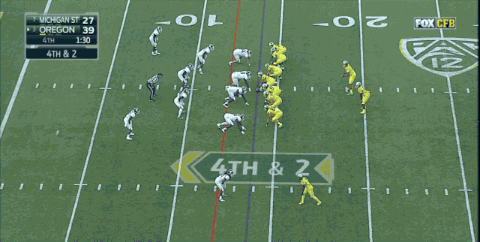
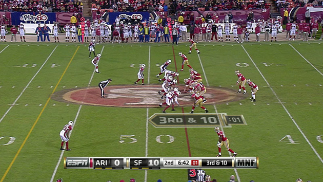
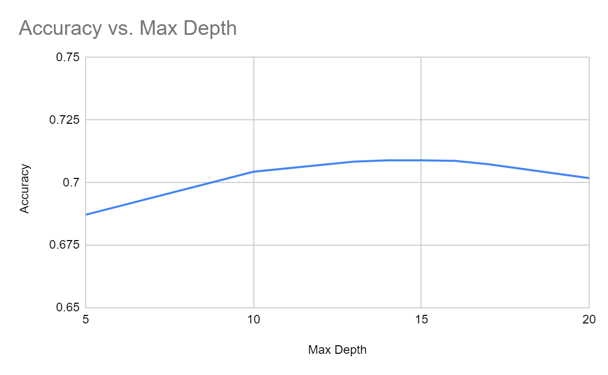
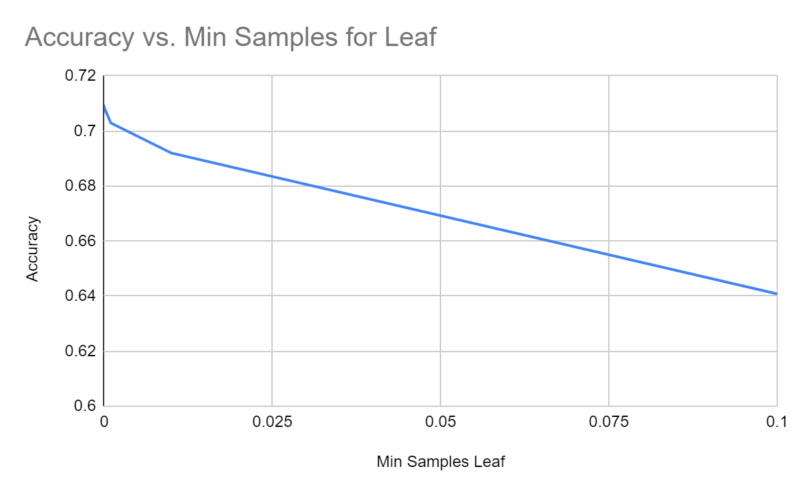
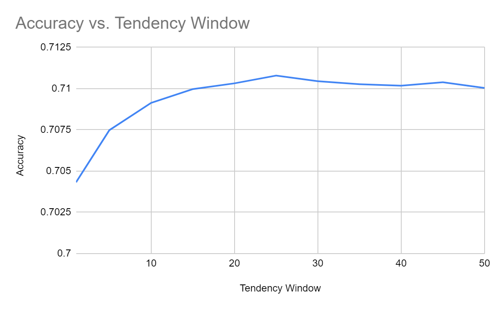
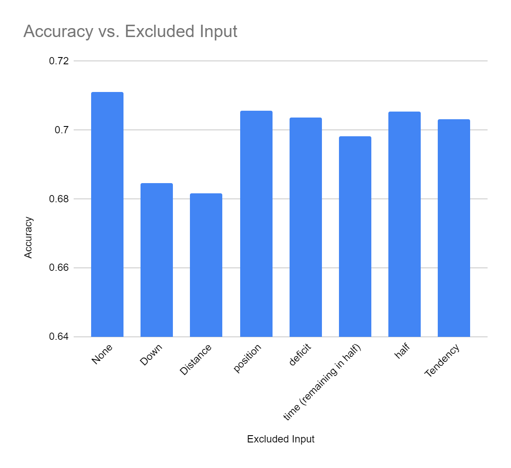
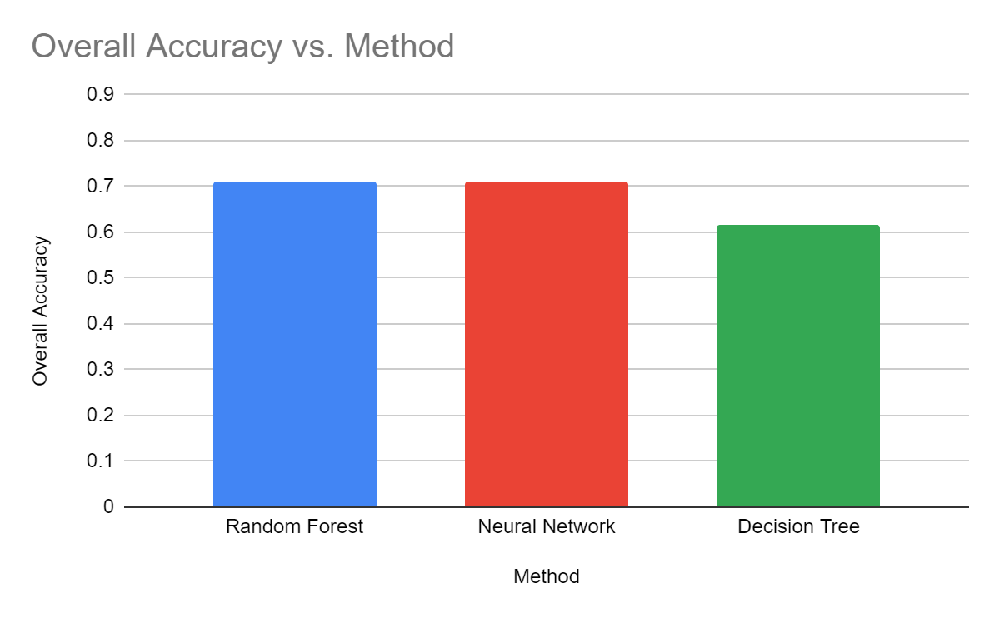
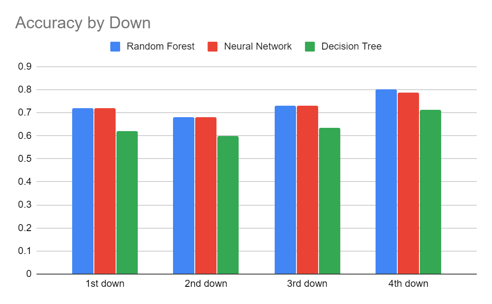
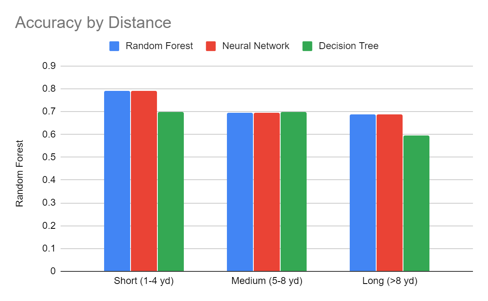

# A Predictive Model for Pass and Rush Plays in College Football

## Background
Football is one of the most entertaining sports to watch.  Whether you’re just a casual fan, a hardcore follower, or a coach or owner of a team, football is extremely fun to watch and analyze.  The idea of the game revolves around teams advancing a ball down a 100-yard playing field to either get it into their opponent’s 20-yard scoring area (end zone) or kick it through the goalposts behind the end zone. When a team has possession of the ball, they are given four attempts (downs) to advance 10 total yards. Each time they reach this goal, they are given another set of attempts to advance. On each down, there are two primary options between which teams have to decide, based on a number of factors, how to run the football.  They are:

- Giving the ball to a player and letting them run (rush) forward until they are tackled.  This is generally considered a safe way to move the ball unless the ball carrier is liable to lose possession of the ball.

1

- Attempting to throw (pass) the ball downfield to another player and letting them run until they are tackled.  This is considered a riskier way to move the ball as a thrown ball can fail to be caught and drop to the ground, or it can be caught and advanced by the opposing team.

2

## Motivation
Every week, coaches and offensive play-callers are scrutinized for the decisions they make on how to advance the ball during games.  Similarly, defensive play-callers are scrutinized on how they go about defending their opponent’s plays.  Often, when an offense achieves a certain degree of balance or unpredictability with how they choose to move the ball, it makes calling the proper defense harder.  This begs the question: is it possible for a computer model to assist a defense by predicting what plays will be called on a given down? We aim to answer this question by creating a machine learning model that can accurately predict whether a team will choose to rush or pass on any given down.

## Data Set
Since we were interested in college football play prediction, we decided to look for a data set with play by play data for college football. We found a Reddit post that directed us to a Google Drive folder containing play by play data for NCAA Division I Football Bowl Subdivision games from 2001 through 2016.3 According to the Reddit post, this data was compiled from ESPN’s database.4 While we admit this was not the most reliable source to get our data from, we decided to use it because the JSON formatted play by play data was ideal for our purposes. Additionally, we did spot check several spots in the data against ESPN’s data and found no discrepancies. Therefore, we believe it is at least accurate enough to train our model.

Our data is not temporal in the traditional sense. Though the original data set included a timestamp, we removed this since it was not relevant to our problem. Play calling is dependent on how much time remains in the game or the half but is relatively unaffected by the long term passage of time. That is to say, a record from 2001 should not receive a different label than an identical record from 2016.

## Features
Out of the dozens of features available in our data set, we determined only a few to be relevant features to the problem we were attempting to solve. These features are as follows.

- Down
- Distance to the line to gain
- Field position
- Score deficit
- Time remaining in half
- Half
- Team Tendency

5

In this example the features (with the exception of team tendency which would be calculated based on the past several pass/rush plays by the offense) would be as follows:

- Down: 3
- Distance to the line to gain: 10
- Field position: 52
- Score deficit: -10
- Time remaining in half: 6.7
- Half: 1

These features are similar to those used in a similar study that used neural networks to predict pass/rush plays.6 However, there are a few notable differences. Rather than using time remaining in the game as a single feature, we decided to instead break it up into time remaining in the half and half. We chose to do this because we knew that strategies tend to be similar when the half is about to end regardless of which half it is, and we believed we could capture this similarity better if we had a feature that reflected how much time was left in the half more directly.

In addition, we decided that we needed a feature that represented the team’s overall tendency to run pass plays or rush plays. This was particularly important since we were attempting to predict college football plays, and college football offensive schemes can vary a lot more than in professional football. To calculate the team tendency, we took the fraction of the past several pass/rush plays on which the team attempted a passing play. We started by using the past 10 pass/rush plays to calculate this value with the intention of figuring out the optimal value during our experimentation.

## Data Parsing
Our first step was to parse the data and pull out the appropriate features for each of the relevant plays. With the exception of the team tendency which required some aggregate data as described above, all of the features we used were easy to determine from the data for a single play in our data set. Some of the 

We were only interested in plays that were either passing or rushing plays, so we ignored all the other play types (like field goal attempt, punt, etc). Our data set contained labels that were for the most part pretty clear on if the play was either a pass play or rush play or something else. However there were certain labels (such as fumble) for which this could not be determined. We left out any plays with these labels. There were also some games (especially from the earlier years) for which data was missing. Finally, we excluded the plays for which there were not enough previous plays to calculate the team tendency. In total we ended up with 914,504 records to use for training and testing our model.

## The Model
We chose to primarily use a random forest classifier for our problem. While random forests will not work for many data types, our data is tabular, so using a random forest classifier is reasonable7. We also considered focusing our experiments on using a neural network, but we ended up choosing the random forest over the neural network for a couple reasons. First of all, a similar experiment has already been done using a neural network, and we thought it would be more useful to see how a different approach performed compared rather than running a nearly identical experiment.6 Additionally, random forests are less computationally intensive and require less training data than a neural network will to solve the same problem. While we do have a fair amount of training data, it is strictly finite since there are only detailed records for a limited number of college football games. Our computational resources were also limited. For these reasons, using a random forest seemed the more practical option. We will however compare our results to those obtained by using a neural net or a decision tree.

## Parameter Tuning
While conducting tests with the information accumulated, we manipulated certain factors behind the decision of making a pass or rush play. These factors include the max depth, the minimum samples, the tendency window, and the excluded input. The excluded input in the trials run during the experiment include the down, distance, position, deficit, time remaining, the current half of the game, and the team tendency.

During our work with this project, we conducted several experiments to determine the optimal strategy for training our data. Since our main focus was on the Random Forest algorithm, most of these tests revolved around finding the optimal settings to use. For all of these experiments, we used k-fold cross validation to determine the average accuracy of our model.

We tested values for the maximum depth of the trees and found that there was a peak accuracy around 14.

As a result of altering the max depth of the decision trees, the accuracy ranged between 0.655553 and 0.708935. We experimented on max depth values of 5, 10, 13, 14, 15, 16, 17, 20, and infinity, and received accuracy of 0.68718, 0.70436, 0.70838, 0.70894, 0.70893, 0.70871, 0.70735, 0.70179, and 0.65555, respectively.

We also tested the best value for the minimum samples needed for each leaf in the trees. We found that smaller values were ideal as it allows more of the data to be expressed in the tree. For this reason, we decided not to specify a minimum samples per leaf since it only seemed to decrease our accuracy.

For minimum samples, 0.1 resulted in 0.640815, and 0.000012 resulted in the highest accuracy of 0.708981. We tested minimum samples valued at 0, 0.000001, 0.000005, 0.000008, 0.00001, 0.000012, 0.00005, 0.0001, 0.001, 0.01, and 0.1, and these resulted in accuracy of 0.70838, 0.70828, 0.70873, 0.70871, 0.70891, 0.70898, 0.70828, 0.70802, 0.70293, 0.69197, and 0.64082, respectively.

One of our features was an estimate of the team’s tendency to rush or pass based on their recent plays. The number of plays this value was based on depended on the size of our tendency window. We found that the accuracy peaked and then gradually decreased after about 25 plays.

For the tendency window, a value of 1 resulted in the lowest accuracy of 0.704321 and a value of 45 resulted in the highest accuracy of 0.710389. We manipulated values of 1, 5, 10, 15, 20, 25, 30, 35, 40, 45, and 50, and as a result obtained accuracy of 0.70432, 0.70748, 0.70914, 0.70997, 0.71032, 0.71079, 0.71044, 0.71027, 0.71018, 0.71039, 0.71003, respectively.

During our first test run of the code used to conduct a randomized forest, the algorithm outputted 67% accuracy. We then proceeded with the goal to maximize the accuracy as much as possible. Given that we obtained trials reaching almost as high as 0.8 with an overall average of just over 71%, it is sufficient to say that we achieved this goal in the process of refining our algorithm.

## Feature Analysis

Next, we tried removing attributes from the data to see if any of them had a negative effect on our overall accuracy. However, accuracy was only reduced when attributes were removed and some factors had less impact than others. We found that distance to the line to gain was the most informative feature, closely followed by down.

Out of the accuracy calculations from excluded input, excluding the distance resulted in the lowest accuracy of 0.681763, and excluding none of the factors resulted in the highest accuracy, 0.711093. As a result of excluding down, we received an accuracy of 0.68459, position, 0.70572, deficit, 0.70354, time remaining, 0.69814, half, 0.70542, and tendency, 0.70313.

## Comparison to Other Algorithms

Our experiment revolved around the testing of three different methods: random forest, neural networks, and decision trees. For each down, we found that in most cases, save one, the method that resulted in the highest accuracy was the randomized forest. The overall accuracy for these three methods was 0.71060 for random forest, 0.71015 for neural network, and 0.61739 for decision tree. Also, while the neural network performed close to the level of the random forest, the random forest did far better in terms of training time, as the neural network took about 10 times as long to train as the random forest.

In the experiments where the results of the randomized forest were compared to those produced by a neural network and by a decision tree, we broke down the results based on the down and distance. The 4th down resulted in the highest accuracy of all three methods, with randomized forest leading with accuracy 0.799874 and with the decision tree lagging at accuracy 0.71098. The 2nd down resulted in the lowest accuracy, with random forest leading with an accuracy of 0.68180, and decision tree having the lowest accuracy of 0.59925. The accuracy obtained for the first down for random forest, neural network, and decision tree were 0.7194942684, 0.7206871299, and 0.6194958693 respectively. For the second down, 0.6817962183, 0.6797323013, and 0.5992514641. For the third down,  0.7310803927, 0.7309246294, and 0.6347498948. And for the fourth down, 0.7998740276, 0.7867571359, and 0.7109764483.

In the case of comparing short, medium, and long distances, short resulted in the highest accuracy, with random forest having the highest value of 0.79003, and decision tree having the lowest value of 0.69836. Long distance ultimately had the lowest accuracy, with random forest having the highest accuracy of 0.68943 and decision tree having the lowest value of 0.59577. The accuracy received for short distance for random forest, neural network, and decision tree were 0.7900374861, 0.7897005306, and 0.6983600818, respectively. For medium distance, 0.6939107395, 0.6947278057, and 0.6005599254. And for long distance, 0.6894296126, 0.6885982235, and 0.5957658658.

## Comparison to Prior Research
We drew inspiration from a similar experiment conducted by MIT that sought to analyze the play prediction created solely through the use of a neural network. The major factors differentiating their experiment from ours are that we focused on a random forest approach (rather than neural network), our experiment aimed to predict plays in college football (rather than NFL), and we used an additional feature to reflect each individual team’s tendency.

This study also viewed the results of their algorithm’s prediction by analyzing the accuracy obtained broken down by distance to the line to gain and down. The averages of the model accuracy from manipulating the distance ranged from 56.13% to 69.72%, and the averages of the naive accuracy range from 51.43% to 66.79%. These values prove to be noticeably smaller than those obtained from our algorithm. Accuracy obtained as a result of monitoring the down ranges between 56.85% and 78.75% for the model data and between 51.84% and 78.44% for the naive data. They sought to improve the accuracy of their algorithm and reduce the loss through the use of activation functions such as tanh and relu, stochastic gradient descent and limited memory BFGS, and testing architectures.6

## Conclusion
Based on these results, the potential of a machine-learning based call-prediction model shows great promise. 70-80% accuracy is rather significant in a fast-moving and highly variable game like football, and we were able to achieve higher accuracy than was achieved previously in a similar study. The use of random forests allowed us to keep accuracy high while also greatly reducing computation time from a neural network approach. Furthermore, by fine tuning the parameters for the random forest, we were able to significantly increase our model’s accuracy. Given more data, such as specific player statistics and their field positioning, it is probable that accuracy of prediction could be increased further.

## Sources
1. https://media2.giphy.com/media/cjjskxVjBC1ag/giphy.gif
2. https://i0.wp.com/huskerchalktalk.com/wp-content/uploads/2016/02/byu_nebraska_oz_play_action_boot.gif
3. https://drive.google.com/drive/folders/0B13YvT1olZIfZ0NKaEZDdGt3TDQ
4. https://www.reddit.com/r/CFBAnalysis/comments/6htfc6/play_by_play_data_dump_20012016/
5. https://cdn-s3.si.com/s3fs-public/images/sportvision-nfl-inline2.jpg
6. Ota, K. L. (2017).
7. https://mljar.com/blog/random-forest-vs-neural-network-classification/ 
